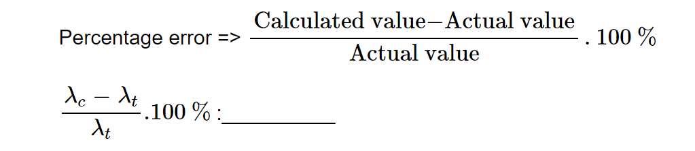

<b>
<u>Procedure for the experiment is as follows:</u>
</b>		

<strong>
To study the Young's Double Slit Experiment
</strong>

<ul type="None">
  <li>
<b>Step 1:</b> Read the theory.
</li>
  <li>
<b>Step 2:</b> Set some value for <b>D</b> (distance from slits to the screen).
</li>
  <li>
<b>Step 3:</b> Set value for <b>d</b> (distance between the slits).
</li>
  <li>
<b>Step 4:</b> Set value for <b>𝛽</b> (Fringe width).
</li>
  <li>
Study the graph in order to understand fringe width, which is given by:
</li>
  <li style="text-align:center;">
    

  </li>
</ul>

 

<b>
<u>Perform the following experiment</u>
</b>

<strong>
<u>Experiment:</u>
</strong>

<u>Aim:</u> Perform the following experiment to verify the wavelength (λt) of the given monochromatic source and to find out the percentage error.

<ol>
  <li>
Set some value for <b>D</b> (distance from slits to the screen).
</li>
  <li>
Set value of <b>d</b> (distance between the slits).
</li>
  <li>
Calculate the value of fringe width (𝛽).
</li>
  <li>
Repeat the experiment 5–6 times, and each time calculate the corresponding value of λc.
</li>
  <li>
Obtain the calculated value λc by calculating the mean.
</li>
  <li>
Verify the values of calculated λc and given λt, and thereby calculate the percentage error.
</li>
  <li>
Where: 
      λc is the calculated value of wavelength. 
      λt is the theoretical value of wavelength.

  </li>
</ol>

 

<table style="width:100%; border-collapse: collapse;" border="1">
  <tr>
    <th style="width:5%">S.No</th>
    <th style="width:20%">D (distance from slits to screen)</th>
    <th style="width:20%">d (distance between slits)</th>
    <th style="width:10%">𝛽 (fringe width)</th>
    <th style="width:20%">λc (wavelength)</th>			
  </tr>
  <tr><td>1.</td><td></td><td></td><td></td><td></td></tr>
  <tr><td>2.</td><td></td><td></td><td></td><td></td></tr>
  <tr><td>3.</td><td></td><td></td><td></td><td></td></tr>
  <tr><td>4.</td><td></td><td></td><td></td><td></td></tr>
  <tr><td>5.</td><td></td><td></td><td></td><td></td></tr>
</table>

 

<ul type="None">
  <li>
Value of λt taken: ____________
</li>
  <li>
The mean value of λc: ___________
</li>
  <li>
    

  </li>
  <li>
<u>Result:</u>
</li>
  <li>
λc = ________________ and Percentage error = ______________
</li> 
</ul>
