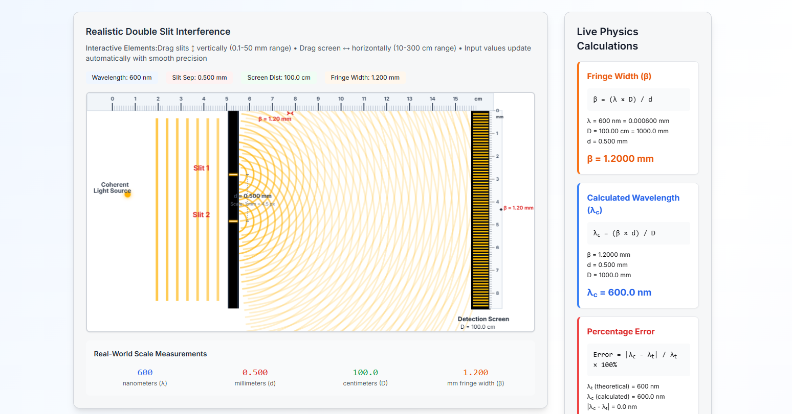
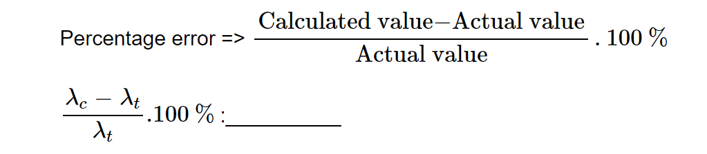

<strong>
To study Interference phenomenon with the Young's Double Slit Experiment
</strong>

<ul type="None">
  <li>
<b>Step 1:</b> Set some value for <b>D</b> (distance from slits to the screen).
</li>
  <li>
<b>Step 2:</b> Set value for <b>d</b> (distance between the slits).
</li>
  <li>
<b>Step 3:</b> Set value for <b>λ</b> (wavelength) to observe <b>β</b> (fringe width).
</li>
  <li>
Study the graph to understand fringe width, which is given by:
</li>
  <li style="text-align:center;">
    

  </li>
</ul>

 

<b>
<u>Perform the following experiment</u>
</b>

<strong>
<u>Experiment:</u>
</strong>

<u>Aim:</u> Verify the wavelength (λt) of the given monochromatic source and find out the percentage error.

<ol>
  <li>
Set some value for <b>D</b> (distance from slits to the screen).
</li>
  <li>
Set value of <b>d</b> (distance between the slits).
</li>
  <li>
Set the value of <b>λ</b> or λt (theoretical wavelength).
</li>
  <li>
Measure the value of fringe width (<b>β</b>) from the scale on the screen.
</li>
  
    

    
<em>Fig. 4. Young's Double-Slit Interference.</em>

  
  <li>
Repeat the experiment 5–6 times; each time calculate the corresponding value of λc using <b>λc = β·d / D</b>.
</li>
  <li>
Obtain the mean calculated value λc.
</li>
  <li>
Verify the values of λc and λt, and thereby calculate the percentage error.
</li>
  <li>
Where: 
      λc = Measured value of wavelength. 
      λt = Theoretical value of wavelength.

  </li>
</ol>

 
<strong>Table 1. Test values for determining the wavelength of light</strong>
 
<table style="width:100%; border-collapse: collapse;" border="1"; >
  <tr>
    <th style="width:5%"; >S.No</th>
    <th style="width:20%;text-align:center">D   (distance from slits to screen)</th>
    <th style="width:20%; text-align:center">d   (distance between slits)</th>
    <th style="width:10%; text-align:center">𝛽  (fringe width)</th>
    <th style="width:20%; text-align:center">λ c  (wavelength)</th>			
  </tr>
  <tr  style="text-align:center"><td>1.</td><td>1.0 m</td><td>0.50 mm</td><td>1.178 mm</td><td>589 nm</td></tr>
  <tr  style="text-align:center"><td>2.</td><td>1.5 m</td><td>0.50 mm</td><td>1.767 mm</td><td>589 nm</td></tr>
  <tr  style="text-align:center"><td>3.</td><td>2.0 m</td><td>0.50 mm</td><td>2.356 mm</td><td>589 nm</td></tr>
  <tr  style="text-align:center"><td>4.</td><td>1.0 m</td><td>1.00 mm</td><td>0.589 mm</td><td>589 nm</td></tr>
  <tr  style="text-align:center"><td>5.</td><td>1.5 m</td><td>1.00 mm</td><td>0.884 mm</td><td>589 nm</td></tr>
</table>

 

<ul type="None">
  <li>
Value of λt taken: <strong>589 nm</strong> (Sodium yellow light)
</li>
  <li>
The mean value of λc: <strong>589 nm</strong>
</li>
  <li style="text-align:center;">
    

  </li>
  <li>
<u>Result:</u>
</li>
  <li>
λc = <strong>589 nm</strong> and Percentage error = <strong>0 %</strong>
</li> 
</ul>
