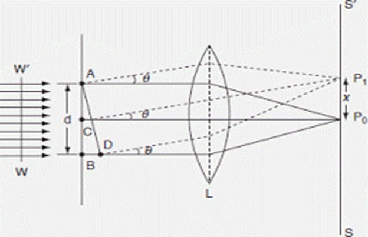
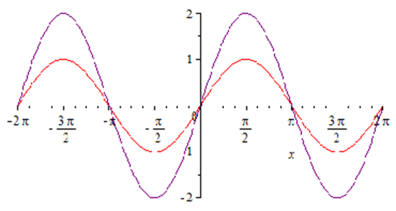
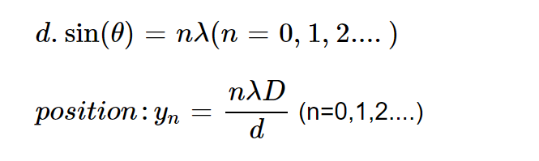
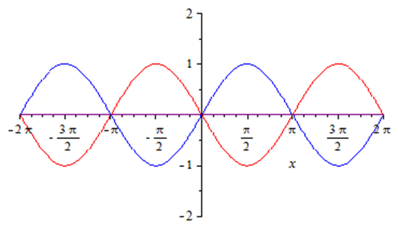
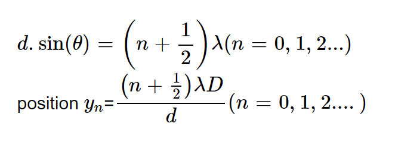
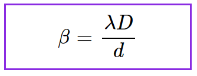

### 1. Wave

A wave is a disturbance that propagates through space or a medium, transferring energy from one point to another without transporting matter.

**Example:** When we make a sharp needle vibrate in a calm pool of water, a circular pattern spreads out from the point of impact. The vibrating needle creates a disturbance that propagates outwards. In this propagation, the water molecules do not move; instead, they move in nearly circular orbits about an equilibrium position. Once the disturbance has passed a certain region, every drop of water is left at its original position.

<em>Fig. 1. Ray diagram of Young's Double Slit interference.</em>

---

### 2. Nature of Light

Light exhibits **wave-particle duality**, meaning it behaves both as a wave and as a particle under different experimental conditions.

#### (a) Particle Nature of Light

A particle is a discrete portion of matter. We refer to light particles as **photons** because of their particle nature. In the 17th century, Sir Isaac Newton proposed the **corpuscular theory of light**, suggesting that light consists of a stream of particles. He supported this idea because when he used a prism to split sunlight into different colours, the periphery of the shadows created was extremely sharp and clear.

#### (b) Wave Nature of Light

A wave is a periodic disturbance that propagates through space or a medium, transferring energy without transporting matter. The wave nature of light states that light is a particular kind of **electromagnetic wave**. Humans can detect only a small portion of the electromagnetic spectrum, known as **visible light**. The first illustration of the wave nature of light was made using experiments on **diffraction** and **interference**.

---

### 3. Interference

When two light waves of the same amplitudes travel simultaneously in the same direction and have a constant phase difference, there is a modification in the intensity of light in the region of superposition. This modification of intensity due to the superposition of two (or more) waves is called **interference**.

Interference produces two types of fringes:

#### (a) Constructive Interference (Bright Fringes)

Constructive interference occurs where the lines (representing peaks) cross over each other — in other words, when two waves are **in phase**.

<em>Fig. 2. Schematic diagram of constructive interference.</em>

**Condition:** `d sinθ = nλ`  &emsp; (n = 0, 1, 2, …) &emsp;&emsp;&emsp;&emsp;&emsp;…(1)

**Position of n-th bright fringe on screen:** `yₙ = nλD / d` &emsp; (n = 0, 1, 2, …) &emsp;…(2)

where:
- θ = diffraction angle (rad)
- d = slit spacing (m)
- λ = wavelength of light (m)
- D = distance from slits to screen (m)
- n = order of the fringe
- When n = 0, θ = 0 → **central bright fringe**

#### (b) Destructive Interference (Dark Fringes)

Destructive interference occurs where two waves are **completely out of phase** — when two waves are out of phase by 180° or π.

<em>Fig. 3. Schematic diagram of destructive interference.</em>

**Condition:** `d sinθ = (n + ½)λ`  &emsp; (n = 0, 1, 2, …) &emsp;&emsp;&emsp;&emsp;…(3)

**Position of n-th dark fringe on screen:** `yₙ = (n + ½)λD / d` &emsp; (n = 0, 1, 2, …) &emsp;…(4)

where:
- θ = diffraction angle (rad)
- d = slit spacing (m)
- λ = wavelength of light (m)
- D = distance from slits to screen (m)

---

### 4. Interference Fringes

When two coherent light waves interfere, **alternate dark and bright bands** are observed on the screen. These are called **interference fringes**.

---

### 5. Young's Double Slit Experiment (YDSE)

When light passes through a single pinhole **S** and then through two closely spaced pinholes **S₁** and **S₂** separated by distance **d**, two spherical coherent waves emerge, producing alternating bright and dark fringes on a screen.

Key parameters:
- **d** : distance between the two slits
- **D** : distance from the slits to the screen
- S₁ and S₂ must be **coherent sources**

**Coherent Sources:** Two or more sources are said to be coherent if the waves originating from them have the same frequency (or wavelength) and bear a **constant phase difference** with time.

---

### 6. Methods of Obtaining Coherent Sources

#### Division of Wavefront

1. **Lloyd's mirror** – Slit S and its virtual image S′ act as coherent sources.
2. **Fresnel's biprism** – Two coherent sources formed by refraction through a biprism.

#### Division of Amplitude

1. **Thin films** – Coherence is obtained by partial reflection and transmission of light.

---

### 7. Fringe Width

**Fringe width (β)** is defined as the distance between two consecutive dark or bright fringes.

**Formula:** `β = λD / d` &emsp;&emsp;&emsp;&emsp;&emsp;&emsp;&emsp;&emsp;&emsp;&emsp;&emsp;&emsp;&emsp;&emsp;&emsp;&emsp;&emsp;…(5)

where:
- β = fringe width (m)
- λ = wavelength of wave (nm)
- d = distance between the slits (m)
- D = distance from slits to screen (m)

The expression for fringe width is the **same for bright and dark fringes**.
