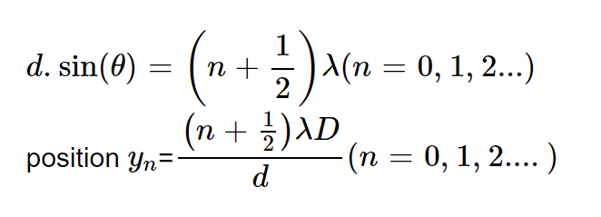
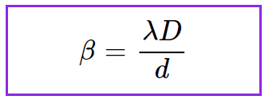

Wave-A wave is a propagation of disturbance.

**Example:** When we make a sharp needle vibrate in a calm pool of water, a circular pattern spreads out from the point of impact. The vibrating needle creates a disturbance that propagates outwards. In this propagation, the water molecules do not move; instead, they move in nearly circular orbits about an equilibrium position. Once the disturbance has passed a certain region, every drop of water is left at its original position.

### Nature of light

The light possesses two natures according to the particle duality of nature.

1. **Particle nature of light:**
   
   A particle is a portion of matter. However, in the particle nature of light, we call light particles photons. In 1700, Sir Isaac Newton stated that light is a bunch of particles because when he used a prism to split sunlight into different colors, the periphery of the shadows created was extremely sharp and clear.

2. **Wave nature of light:**
   
   A wave is a periodic oscillation by which energy is transmitted through space.  
   The wave nature of light states that the light is a type of electromagnetic wave.  
   Humans can see this wave. The first illustration of the wave nature of light was using the experiments on diffraction and interference. The production of light is from one of these two methods—  
   **Incandescence:** It is the emission of light from hot matter.  
   **Luminescence:** It is the emission of light during the fall of excited electrons to the ground level.

### Interference

When two lights of the same frequency travel simultaneously in the same direction and have a constant phase difference, then there is a modification in the intensity of light in the region of superposition. The modification is the intensity of light due to the superposition of two (or more) waves, which is called interference. Interference is of two types:

- **Constructive interference:** Constructive interference occurs where the lines (representing peaks) cross over each other. In other words, when two waves are in phase.

  

  
  

  

  
  

  where:
  - θ: diffraction angle (rad)
  - d: slit spacing (m)
  - λ: wavelength of light (m)
  - D: distance from slit to screen (m)
  - When n = 0, then the diffraction angle of the central axis θ = 0

- **Destructive interference:** Destructive interference occurs where two waves are completely out of phase. In other words, when two waves are out of phase by 180° or π,
 

  

  
  

  Destructive interference:

  

  
  

  where:
  - θ: diffraction angle (rad)
  - d: slit spacing (m)
  - λ: wavelength of light (m)
  - D: distance from slit to screen (m)

### Interference Fringes

When two light waves are made to interfere, we get alternate dark and bright bands of a regular or irregular shape. These are called interference fringes.

### Young's double experiment

When the light is allowed to fall on a pinhole S and then through two pinholes, S₁ and S₂, placed at a distance d, then two spherical waves emerging from S₁ and S₂ merge together, and alternating bright and dark bands are observed on the screen, which is at distance D from the two sources. The resultant amplitude obtained is greater.

1. The distance between two slits is d.
2. The sources used are coherent sources.
   
   **Coherent sources:** When two light waves having sharply defined phase difference that remains constant with time, they are said to be coherent. They can be obtained via two different methods as follows:

#### Division of wavefront

1. **Lloyd's mirror:** In this device, a slit s and its virtual image s' are formed by reflection at a mirror.
2. **Fresnel's biprism:** Coherent sources formed by refraction from a biprism.

#### Division of amplitude

1. **Thin films:** In this, coherent sources are obtained by division of amplitude.

### Fringe width

It is defined as the distance between two alternative dark or bright bands.

Expression for fringe width:

where:
- 𝛽 = fringe width (m)
- λ = wavelength of wave (nm)
- d = distance between the slits (m)

The expression for fringe width is the same for bright and dark bands.
